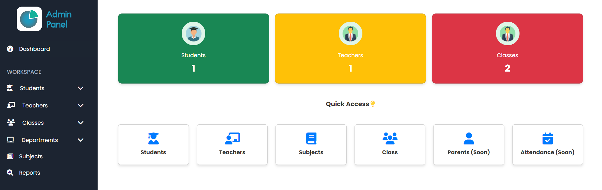
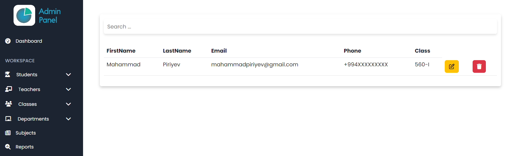
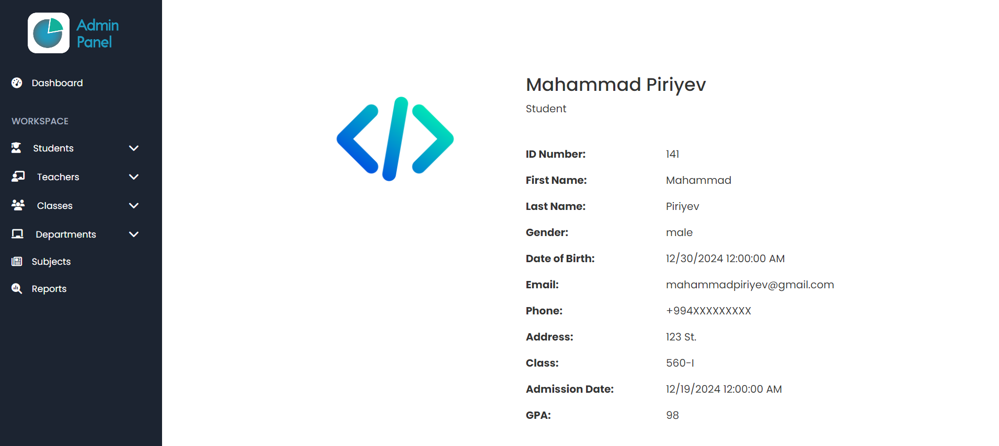

# School Management System

A web-based School Management System built using **ASP.NET Core MVC**. This application provides functionalities for managing students, teachers, courses, and school administration tasks efficiently.

## Features

- 🛡️ **Authentication and Authorization**: Role-based access for Admin.
- 👨‍🎓 **Student Management**: Add, update, view, and delete student records.
- 👩‍🏫 **Teacher Management**: Manage teacher profiles and assignments.
- 📚 **Course Management**: Create and manage courses and their schedules.
- 📊 **Dashboard**: Admin dashboard with insights and analytics.

## Technologies Used

- ⚙️ **Backend**: ASP.NET Core MVC, Entity Framework Core
- 🎨 **Frontend**: Razor Pages, Bootstrap, JavaScript
- 🗄️ **Database**: MS SQL Server
- 🗂️ **Version Control**: Git

## Getting Started

### Prerequisites

- 🛠️ .NET SDK 6.0 or later
- 🗄️ MS SQL Server
- 🖥️ Visual Studio or any preferred code editor

### Installation

1. 🌀 Clone the repository:
   ```bash
   git clone https://github.com/yourusername/school-management-system.git
   ```

2. 📂 Navigate to the project directory:
   ```bash
   cd school-management-system
   ```

3. 🔧 Restore the required packages:
   ```bash
   dotnet restore
   ```

4. 📝 Update the connection string in `appsettings.json`:
   ```json
   "ConnectionStrings": {
     "DefaultConnection": "Server=YOUR_SERVER_NAME;Database=SchoolManagement;Trusted_Connection=True;"
   }
   ```

5. 📦 Apply migrations and seed the database:
   ```bash
   dotnet ef database update
   ```

6. ▶️ Run the application:
   ```bash
   dotnet run
   ```

7. 🌐 Open your browser and navigate to `https://localhost:5001` (or the specified URL).

## Project Structure

```plaintext
SchoolManagementSystem
├── School
│   ├── Areas
│   ├── Models
│   ├── Views
│   ├── wwwroot
│   ├── appsettings.json
│   └── Program.cs
├── School.Business
│   ├── Abstract
│   │   ├── IStudentService.cs
│   │   └── ITeacherService.cs
│   ├── Concrete
│       ├── StudentService.cs
│       └── TeacherService.cs
├── School.DataAccess
│   ├── Data
│   ├── Migrations
│   └── Repository
├── School.Entities
│   ├── Abstract
│   ├── ViewModels
│   ├── Models ...
└── School.Utility
```

### Description of Key Components

- **School**: Contains the main application files like Models, Views, Controllers, and configuration files.
- **School.Business**: Contains business logic with interfaces (Abstract) and their implementations (Concrete).
- **School.DataAccess**: Handles data operations, migrations, and database context.
- **School.Entities**: Defines the core data models and view models for the application.
- **School.Utility**: Includes utility classes and helper methods.

## Screenshots






## License

This project is licensed under the [MIT License](LICENSE).

---

Feel free to improve this README or add new features to the project. Happy coding!
